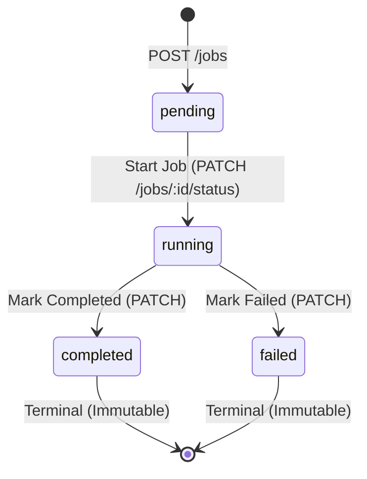

# 🚀 QueuePilot — Mini Job Queue Management Dashboard

A production-grade, full-stack **Job Queue Management Dashboard** built with **React.js, Node.js, Express, and SQLite**, engineered with strict state machine validation, **atomic concurrency control (OCC)**, and race condition prevention.

---

## 📋 Table of Contents
- [Architecture Overview](#-architecture-overview)
- [Tech Stack](#-tech-stack)
- [Key Features](#-key-features)
- [State Machine & Concurrency Deep Dive](#-state-machine--concurrency-deep-dive)
  - [Answers to "Think About This" Questions](#answers-to-think-about-this-questions)
- [Bonus Feature: Production Readiness](#-bonus-feature-production-readiness)
- [API Documentation](#-api-documentation)
- [Local Setup & Run Instructions](#-local-setup--run-instructions)
- [Automated Testing](#-automated-testing)
- [Assumptions, Trade-Offs & Scaling Considerations](#-assumptions-trade-offs--scaling-considerations)
- [Deployment Guide](#-deployment-guide)

---

## 🏛 Architecture Overview

```
AIRTHproject/
├── backend/                  # Node.js & Express API server
│   ├── src/
│   │   ├── config/database.js       # SQLite connection with WAL mode & table schemas
│   │   ├── controllers/jobController.js # HTTP request/response handlers
│   │   ├── middleware/
│   │   │   ├── errorHandler.js      # Centralized error mapping (400, 404, 409, 500)
│   │   │   └── validator.js         # Schema & status validation middleware
│   │   ├── models/jobModel.js        # Data layer with atomic conditional updates
│   │   ├── routes/jobRoutes.js       # Express route declarations
│   │   ├── services/jobService.js    # State machine rules & race simulation
│   │   ├── tests/jobs.test.js        # Automated test suite (Jest + Supertest)
│   │   ├── app.js                    # Express app configuration
│   │   └── server.js                 # Server entrypoint
│   ├── package.json
│   └── .env.example
├── frontend/                 # React + Vite + Tailwind CSS Dashboard
│   ├── src/
│   │   ├── components/
│   │   │   ├── Header.jsx            # App header with connection health & action buttons
│   │   │   ├── StatsOverview.jsx     # 5 Metric cards (Total, Pending, Running, Completed, Failed)
│   │   │   ├── FilterBar.jsx         # Status pills, search bar, sort, & 3s auto-refresh toggle
│   │   │   ├── JobList.jsx           # Skeleton loading, empty states, error handling
│   │   │   ├── JobCard.jsx           # Dynamic state action buttons & terminal state locking
│   │   │   ├── CreateJobModal.jsx    # New job creation with preset chips
│   │   │   ├── ConcurrencyDemoModal.jsx # Visual 2-tab race simulation & explainer
│   │   │   ├── JobHistoryModal.jsx   # State transition audit log timeline
│   │   │   ├── ConfirmModal.jsx      # Safe deletion confirmation modal
│   │   │   └── Toast.jsx             # Toast notifications (Success, Conflict 409, Error)
│   │   ├── services/api.js           # Fetch API service layer with error handling
│   │   ├── App.jsx                   # Main coordinator state
│   │   └── main.jsx
│   ├── package.json
│   ├── vite.config.js
│   └── tailwind.config.js
├── package.json              # Monorepo orchestration scripts
└── README.md                 # Complete documentation
```

---

## 💻 Tech Stack

- **Frontend**: React 18, Vite, Tailwind CSS, Lucide React (clean, responsive, dark-mode slate aesthetic).
- **Backend**: Node.js, Express.js (as specified in place of NestJS), CORS, Morgan.
- **Database**: SQLite (Node native `DatabaseSync` with Write-Ahead Logging `WAL` mode and transactions).
- **Testing**: Jest, Supertest (14 integration & concurrency tests).

---

## ✨ Key Features

1. **Strict Lifecycle State Machine**:
   - `pending` $\rightarrow$ `running` $\rightarrow$ `completed` OR `failed`
   - Terminal state lock: `completed` and `failed` jobs are strictly immutable and cannot be transitioned again.
2. **Atomic Concurrency Protection**:
   - Backend database conditional update: `UPDATE jobs SET status = ?, version = version + 1 WHERE id = ? AND status = ?`.
   - Simultaneous conflicting updates return a clear **HTTP 409 Conflict** error with details.
3. **Interactive Concurrency Simulator**:
   - Built-in UI modal and backend simulation endpoint (`POST /jobs/:id/simulate-race`) firing two requests at the same millisecond to prove race-condition safety visually.
4. **Transition Audit Log (Job History)**:
   - Full chronological audit history (`job_logs`) recording every transition, timestamp, and context.
5. **Real-time UX Polish**:
   - Live 3-second auto-polling with radar pulse indicator.
   - Status summary cards with instant filter switching.
   - Search by title or type with debounce.
   - Responsive design with smooth toast alerts for all actions.

---

## 🧠 State Machine & Concurrency Deep Dive

### Lifecycle Rules:


---

### Answers to "Think About This" Questions

#### 1. Where should this rule be enforced?
> **Answer**: The state transition and concurrency rules **must always be enforced at the backend and database layer**, never solely on the frontend client.
> 
> *Why?*
> - The client UI is merely a presentation layer. Any user can open DevTools, disable buttons, edit JavaScript state, or send raw HTTP requests.
> - Network latency means client-side state is inherently stale. A user might click a button based on data cached 2 seconds ago.
> - Enforcing rules at the database boundary (using atomic conditional SQL queries and transactions) provides the ultimate source of truth and ACID guarantees.

#### 2. What happens if someone bypasses the React application and calls the API directly?
> **Answer**: The API remains 100% protected and impervious to bypass.
> - If an attacker or external client sends `PATCH /jobs/:id/status` with an invalid transition (e.g. `pending` $\rightarrow$ `completed` directly, or `completed` $\rightarrow$ `running`), the backend's `validator.js` and `jobService.js` validate the transition against `VALID_TRANSITIONS`.
> - If the transition is illegal, the backend immediately halts and returns `HTTP 400 Bad Request` or `HTTP 409 Conflict`:
>   ```json
>   {
>     "success": false,
>     "error": {
>       "code": "CONFLICT",
>       "message": "Job is in terminal state 'completed'. Completed or failed jobs cannot be modified or run again."
>     }
>   }
>   ```

#### 3. What happens when two requests arrive at nearly the same time?
> **Answer**: In an unhandled system, a **race condition** (check-then-act vulnerability) occurs:
> 1. Request A reads the job as `pending`.
> 2. Request B reads the same job as `pending` before Request A finishes writing.
> 3. Both requests determine the transition is valid and proceed to transition to `running`.
> 4. In a real-world queue, two different worker nodes would duplicate execution of the exact same task (e.g., charging a customer twice, sending two emails, double-exporting data).
> 
> In **QueuePilot**, this race condition is eliminated:
> - SQLite transactions with `BEGIN IMMEDIATE` and atomic conditional updates ensure only **one** request succeeds (`changes === 1`), while the competing request matches 0 rows (`changes === 0`).
> - Request A receives `HTTP 200 OK`.
> - Request B is cleanly rejected with `HTTP 409 Conflict`.

#### 4. How would you prevent an invalid or inconsistent state?
> **Answer**: We employ **Optimistic Concurrency Control (OCC)** coupled with **Atomic Conditional Updates**:
> ```sql
> UPDATE jobs 
> SET status = @newStatus, version = version + 1, updated_at = @now 
> WHERE id = @id AND status = @expectedCurrentStatus;
> ```
> - If `result.changes === 0`, we query the current row state:
>   - If the row does not exist: Return `HTTP 404 Not Found`.
>   - If the row exists but the status was already changed by a competing thread: Return `HTTP 409 Conflict`.
> - This guarantees serialization without deadlocks or blocking table locks.

---

## 🏆 Bonus Feature: Production Readiness

### 1. Optimistic Concurrency Control (OCC) with Versioning & Transition Audit Trail
- Every job maintains an integer `version` field. On every valid status transition, the version increments (`v1` $\rightarrow$ `v2` $\rightarrow$ `v3`).
- Every state transition is recorded into a persistent `job_logs` audit table capturing:
  - `job_id`
  - `from_status`
  - `to_status`
  - `timestamp` (ISO 8601)
  - `details` (context / trigger reason)
- In production, audit logs are indispensable for compliance, incident debugging, and post-mortems.

### 2. Live Concurrency & Race Simulator
- An interactive tool is built right into the UI header ("Concurrency Simulator") and on every pending job card ("Test Race").
- When clicked, it dispatches two concurrent asynchronous requests that race against the database, proving real-time 409 Conflict handling.

---

## 📡 API Documentation

### Base URL: `http://localhost:5000`

| Method | Endpoint | Description |
|---|---|---|
| `GET` | `/health` | Health check endpoint |
| `GET` | `/jobs` | Retrieve all jobs (supports `?status=`, `?search=`, `?sort=`) |
| `POST` | `/jobs` | Create a new job in `pending` status |
| `GET` | `/jobs/:id` | Get details of a single job |
| `PATCH` | `/jobs/:id/status` | Transition job status (`pending` $\rightarrow$ `running` $\rightarrow$ `completed` / `failed`) |
| `DELETE` | `/jobs/:id` | Delete a job and its audit history |
| `GET` | `/jobs/:id/logs` | Retrieve transition history audit logs |
| `POST` | `/jobs/:id/simulate-race` | Trigger concurrent 2-tab race simulation |

---

### Example Requests

#### 1. Create a Job
```bash
curl -X POST http://localhost:5000/jobs \
  -H "Content-Type: application/json" \
  -d '{"title": "Render Promotional 4K Video", "type": "VIDEO_ENCODING"}'
```

#### 2. Get All Jobs with Filter
```bash
curl -X GET "http://localhost:5000/jobs?status=pending&sort=desc"
```

#### 3. Transition Status to Running
```bash
curl -X PATCH http://localhost:5000/jobs/job_12345678/status \
  -H "Content-Type: application/json" \
  -d '{"status": "running"}'
```

#### 4. Simulate Concurrent Race Condition
```bash
curl -X POST http://localhost:5000/jobs/job_12345678/simulate-race
```

---

## 🛠 Local Setup & Run Instructions

### Prerequisites
- Node.js version 18 or higher (Node 20, 22, and 24 fully supported).
- npm version 9 or higher.

### Quick Start (Single Command)

1. **Clone the repository**:
   ```bash
   git clone <YOUR_GITHUB_REPO_URL>
   cd AIRTHproject
   ```

2. **Install all dependencies**:
   ```bash
   npm run install:all
   ```

3. **Start the Backend Server** (Terminal 1):
   ```bash
   npm run dev:backend
   ```
   *Runs at `http://localhost:5000`.*

4. **Start the Frontend Dashboard** (Terminal 2):
   ```bash
   npm run dev:frontend
   ```
   *Open `http://localhost:5173` in your browser.*

---

## 🧪 Automated Testing

QueuePilot includes an extensive automated integration and concurrency test suite with 14 comprehensive test cases:

```bash
npm run test
```

### Test Coverage Highlights:
- ✅ Health check & initial database state
- ✅ Input validation & error messaging for missing fields
- ✅ Strict state machine transition validation
- ✅ Disallowing illegal transitions (`pending` $\rightarrow$ `completed`, `completed` $\rightarrow$ `running`)
- ✅ Terminal state immutability
- ✅ **10 Concurrent Requests Race Test**: 10 parallel requests hitting the same pending job simultaneously $\rightarrow$ Exactly 1 succeeds (HTTP 200), and 9 are rejected with HTTP 409 Conflict.
- ✅ Audit logging verification
- ✅ Cascade deletion verification

---

## ⚖ Assumptions, Trade-Offs & Scaling Considerations

| Decision / Area | Current Implementation | Trade-Off | Production Scale-Up (Future Improvement) |
|---|---|---|---|
| **Database** | SQLite with WAL mode | Single-file, zero setup, excellent read/write throughput for single-node. | Migrate to **PostgreSQL** with row-level locks (`SELECT ... FOR UPDATE`) or read replicas for multi-node deployments. |
| **Concurrency Locking** | Atomic Conditional Updates + SQLite transactions | Highly efficient, non-blocking, zero deadlocks. | Implement **Redis Distributed Locking (Redlock)** across Kubernetes worker pods to ensure distributed mutual exclusion. |
| **Real-time Sync** | HTTP Polling (3s interval) with toggle | Simple, stateless, resilient across network disconnects. | Upgrade to **WebSockets (Socket.io) or Server-Sent Events (SSE)** for instant push notifications upon status change. |
| **Worker Processing** | API status transition endpoints | Simulates queue lifecycle synchronously. | Integrate a message broker such as **BullMQ with Redis** or **RabbitMQ** with automated worker retry backoff. |

---

## 🚀 Deployment Guide

### Deploy Unified Fullstack to Vercel (Recommended)
This repository includes a native `vercel.json` and `api/index.js` serverless function configuration:
1. Import repository into **Vercel**.
2. Keep root directory as `./` (default).
3. Vercel automatically detects the build command (`npm run build:frontend`) and serves both frontend and backend APIs under the same domain without CORS issues.

### Deploy Backend Separately (Render / Railway / Fly.io)
1. Set Environment Variables: `PORT=5000`, `NODE_ENV=production`.
2. Build Command: `npm --prefix backend install`
3. Start Command: `node backend/src/server.js`

### Deploy Frontend Separately (Vercel / Netlify)
1. Root directory: `frontend`
2. Build Command: `npm run build`
3. Output directory: `dist`
4. Environment variable: `VITE_API_URL=https://your-deployed-backend.com`
